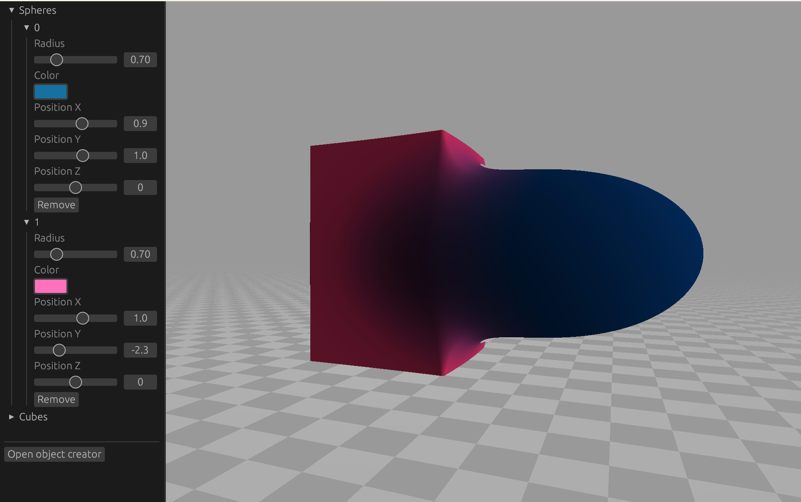

# Very cool ray marcher

## Description

This is a basic ray-marching program that can render spheres and cubes with different rendering schemes. 

Project specifications can be found [here](SPEC.md)

## Compiling and running

The program can be compiled and ran using `cargo run` in the project directory.

## Authors

[NatanHy](https://github.com/NatanHy)

[HenrikSvensson04](https://github.com/HenrikSvensson04)